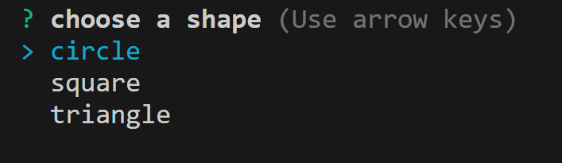
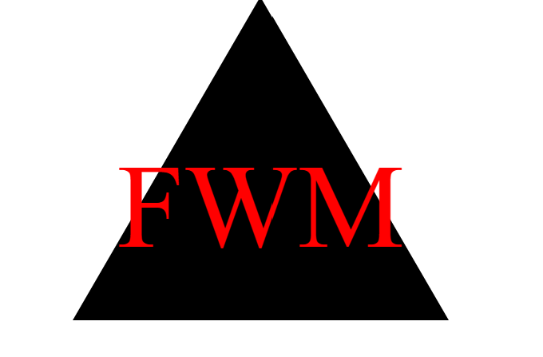

# SVG Logo Generator

## Description:
This project is a Logo Generator Application, the code was generated by myself with the assistance of the GWU coding Boot camp tutoring program. Using this will allow a user to run an integrated terminal which will prompt the user with a series of questions. Upon answering the question a logo will be generated. The Logo question include: what letters will be used, the color of the letters, the shape of the logo, this will come from a predetermined list of shapes, and the color of the shape.

## Installation:
This application requires installation of VS Code and any software that allows the user to open and view SVG files.

## Usage: 
### The user will open the terminal and be greeted with a set of questions, these questions are: "Input text", "What Color Text", "Choose shape", and "What color shape would you like"

### Upon completing the questions the user will see their inputs and be will recieve a message that the logo was successfully generated.

### After the successful generation of the logo the user will be able to open the SVG file and view their logo.

MIT License
